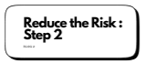
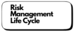
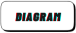

<h3>Hello! I'm Nolene, </h3>
An avid learner and enthusiast in the field of cybersecurity. This repository is a showcase of my projects, explorations, and insights related to CompTIA Security+ and beyond. Each project is a step towards mastering the art and understanding the intricate nuances of cyber threats and defences.

Feel free to explore, contribute, or simply connect. Your feedback and collaboration are always welcome.

 : nolenehuman@hotmail.com

 : www.linkedin.com/in/nolenehuman

Stay secure, and happy coding!

_________________

<h3>Projects</h>

<!-- blog links -->

     ... more coming soon ...

<!-- blog code links -->

--------------------------------

<!--  |  | ...coming soon ... -->

<h3>Languages and Tools:</h3>

| Languages |  | Tools | 
| :---: | :---: | :---: | 
| Python | |Figma |
| HTML | |Microsoft Threat Modelling Tool|
|  | |Visio|

<https://github.com/users/Nolene-Human/projects/3/views/1?visibleFields=%5B%22Title%22%2C%22Assignees%22%2C%22Status%22%2C%22Repository%22%5D&pane=info>: Project

                                           

